# AR1LS-COMMERCIAL
### Discord: ar1ls Telegram: @ar1ls

# [УСЛУГИ]()
1. Продажа самописных модификаций для серверов.
2. Разработка Discord-ботов разной сложности, продажа уже готовых ботов.
3. Разработка плагинов, модов.
# [ПРИМЕР РАБОТ]()
1. **[МОД/КЛИЕНТ] Loot Beams**, порт мода с 1.16.5, добавляет отображение лучей, nbt, имён над предметами: 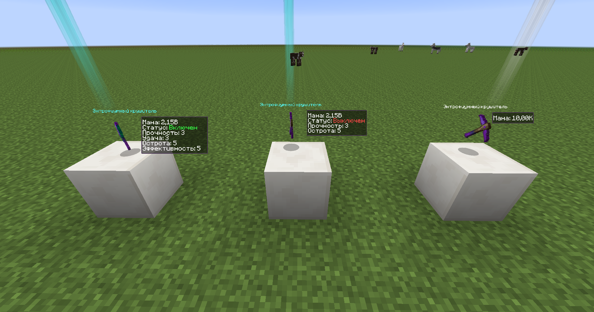
2. **[МОД/СЕРВЕР] ArtMod**. Отображение артов, картинок и т.п. 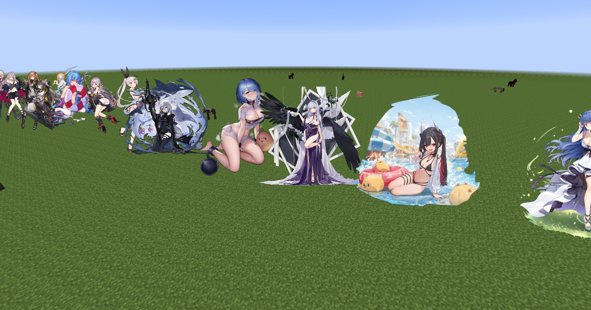  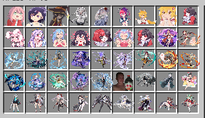 
3. **[ГУИ/КЛИЕНТ+ПЛАГИН] InfoGUI**. Отображение статистики, приватов, кастомный таб, настройки положения, размера и др.     
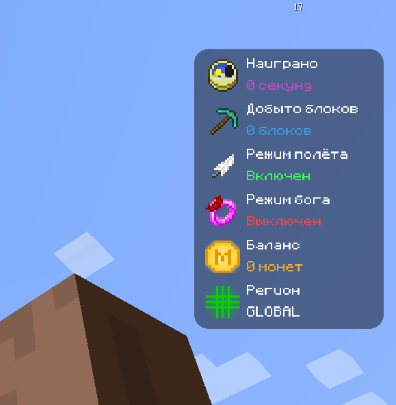 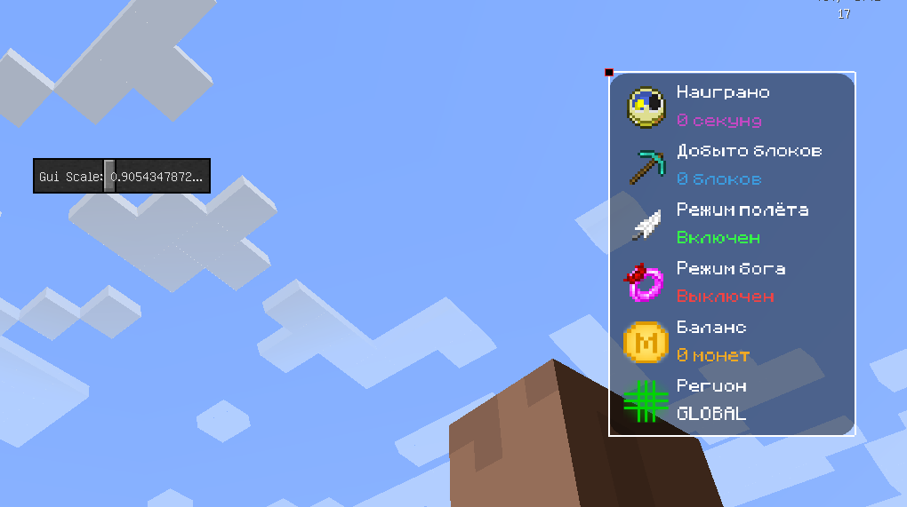 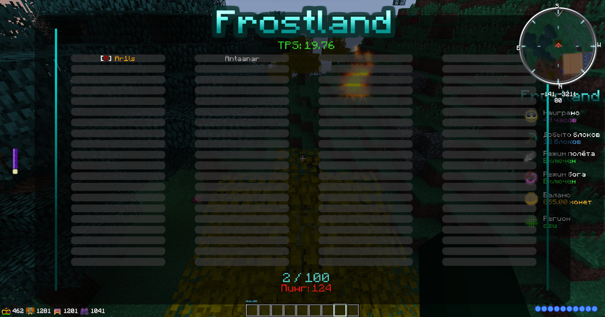
4. **[ГУИ/КЛИЕНТ] CustomMenu**. Замена стандартному меню 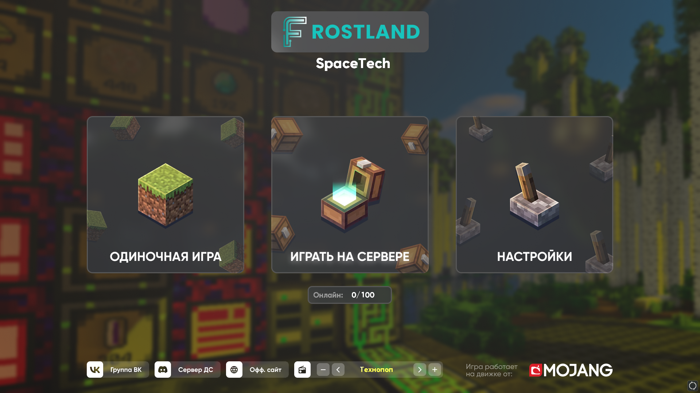
5. **[МОД/СЕРВЕР] IC2Addon**. Мод-аддон, реализованно: панельки, молекулярный преобразователь, автоспавнера и др.
 
	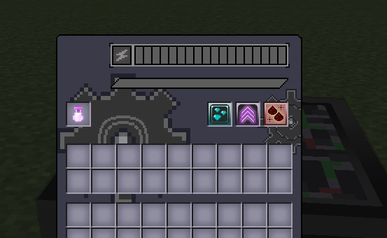 																		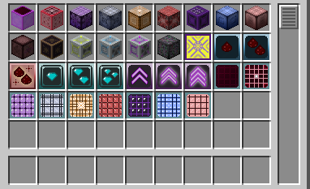 
6. **[МОД/СЕРВЕР] AvaritiaAddon**, улучшенные сборщики нейтрония. 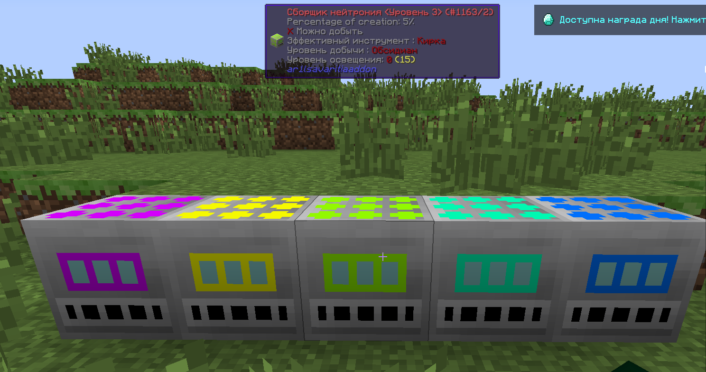 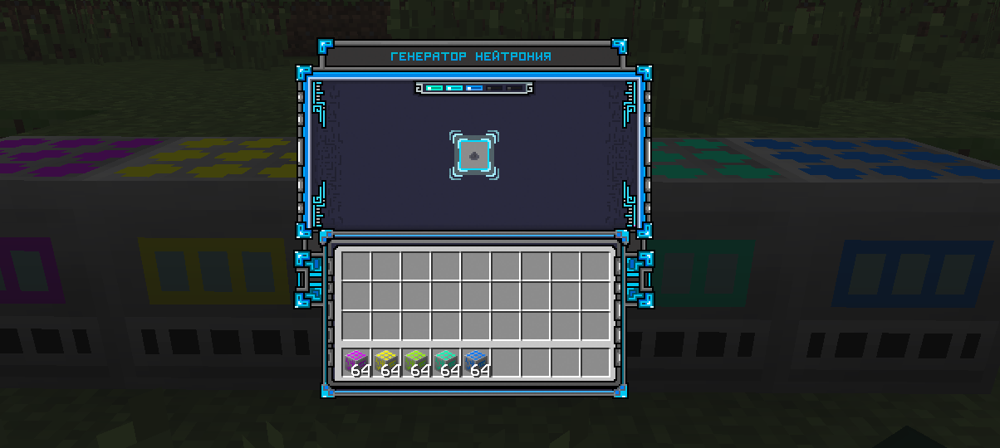
7. **[МОД/СЕРВЕР] BotaniaAddon**, реализованно: бассейны, распространители, искры, кольца, броня и др. 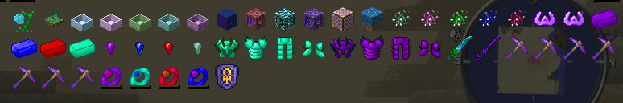
8. **[МОД/СЕРВЕР] AdditionalsCapacitors**, улучшенные capacitor'ы для EnderIO, возможность добовлять новые, настраивать для большинства механизмов через конфиг-файл.
 
	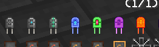 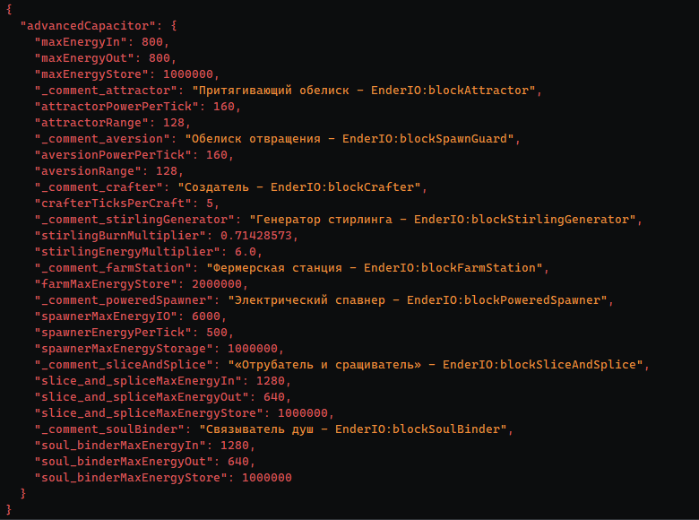
9. **[ПЛАГИН] DupeLog**. трекер предметов и взаимодействий с ними 
