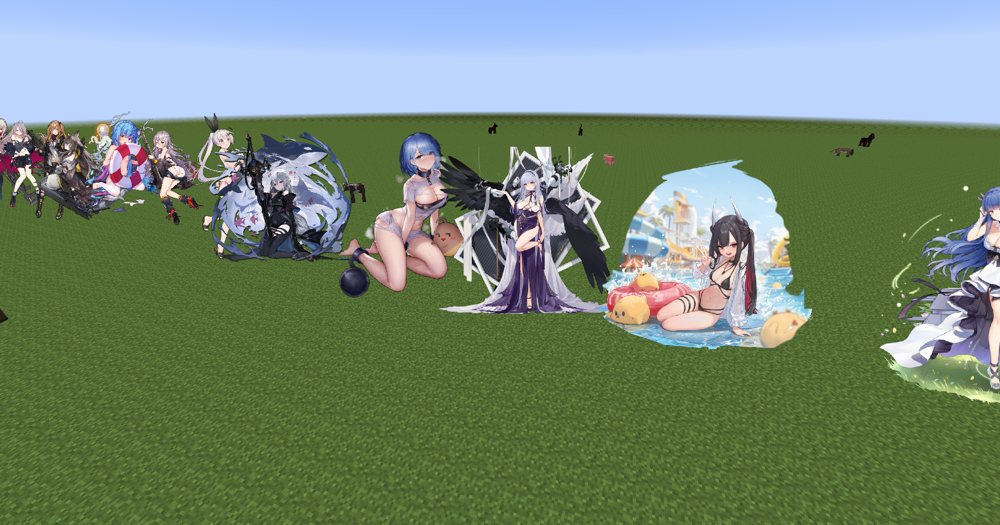
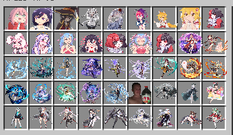
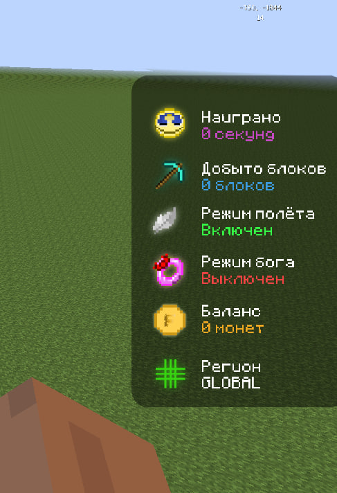
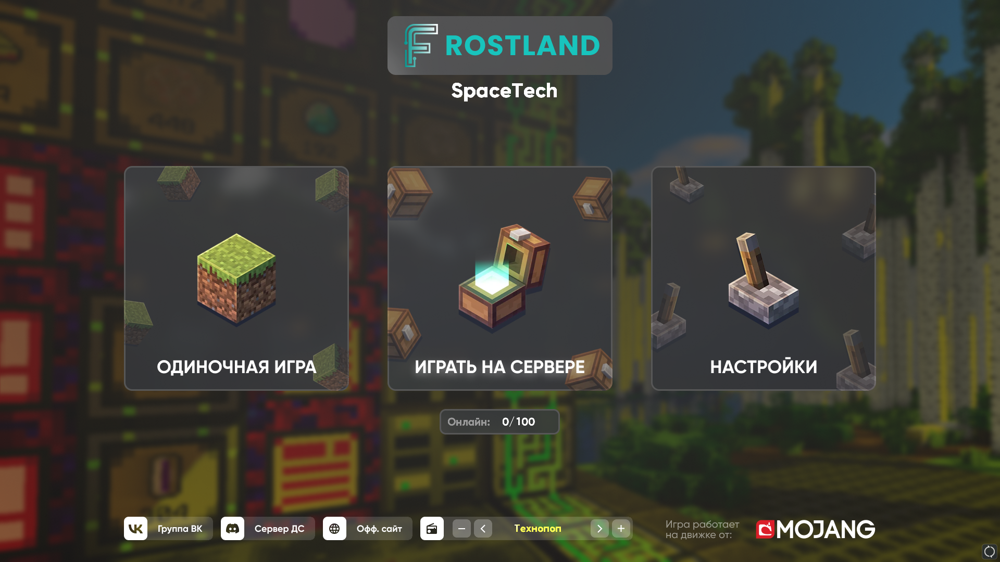
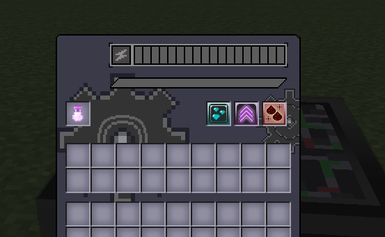
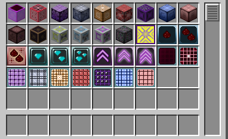
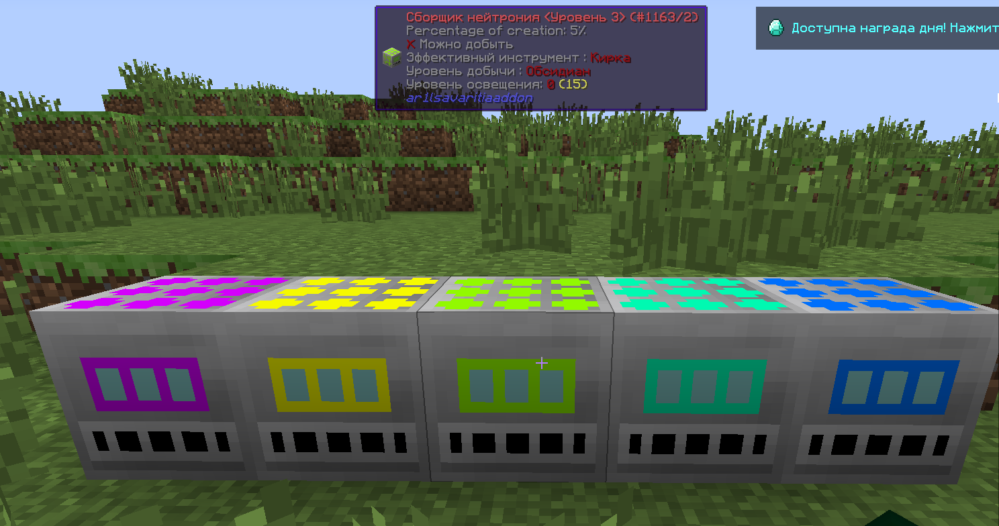
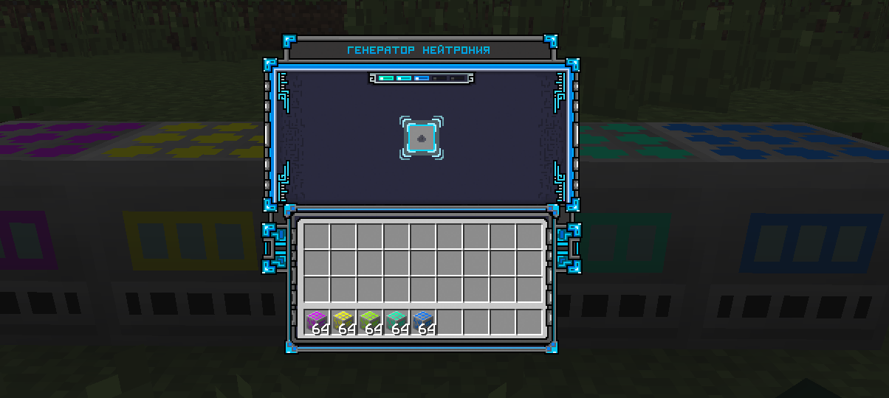
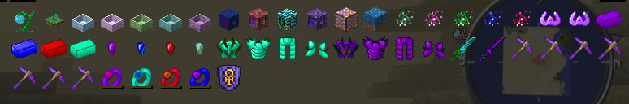
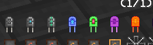

# AR1LS-COMERCIAL
### Discord: ar1ls Telegram: @ar1ls

# [УСЛУГИ]()
1. Продажа самописных модификаций для серверов.
2. Разработка Discord-ботов разной сложности, продажа уже готовых ботов.
3. Разработка плагинов.
# [ПРИМЕР РАБОТ]()
1. **[МОД/СЕРВЕР] ArtMod**. Отображение артов, картинок и т.п.    
2. **[ГУИ/КЛИЕНТ+ПЛАГИН] InfoGUI**. Отображение статистики, приватов и др. 
3. **[ГУИ/КЛИЕНТ] CustomMenu**. Замена стандартному меню 
4. **[МОД/СЕРВЕР] IC2Addon**. Мод-аддон, реализованно: панельки, молекулярный преобразователь, автоспавнера и др.                                 
5. **[МОД/СЕРВЕР] AvaritiaAddon**, улучшенные сборщики нейтрония.  
6. **[МОД/СЕРВЕР] BotaniaAddon**, реализованно: бассейны, распространители, искры, кольца, броня и др. 
7. **[МОД/СЕРВЕР] AdditionalsCapacitors**, улучшенные capacitor'ы для EnderIO.
 
	

8. **[ПЛАГИН] DupeLog**. трекер предметов и взаимодействий с ними 
